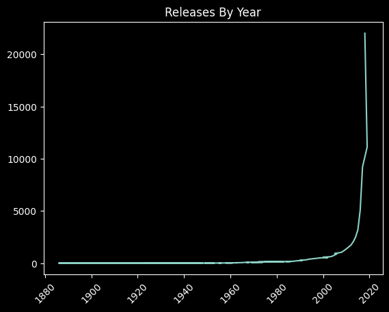

# _Data Engineering Week 4 Code Review_

#### By _**Drew White**_

#### _Code review for week 4 of Data Engineering: Pandas_

## Technologies Used

- _Python_
- _Jupyter Notebooks_
- _Pandas_
- _matplot_

## Description

 _Python code review for week 4 of Data Engineering demonstrating use of the Pandas library and different methods of profiling large data files. Steps taken in code review are as follows:_ 

- _Load csv data files as DataFrame and begin to profile data using: `head`, `tail`, `shape`_
- _Navigate different sections and columns of data frame using `loc` and `iloc`_
- _Identify and remove duplicates from all lists._
- _Clean `artists_df`  data set using a function to use within `map` function to replace empty lists with `NaN`_
- _Clean Tracks data set by dropping `lyrics` column._
- _Join `artists_df` and `albums_df` data sets on `artist_id`. Print `head` and `shape` ->`artists_albums`_
- _Join `albums_df` and `tracks_df` on the `album_id`. Print `head` and `shape` -> `albums_tracks`_
- _Use `Pandas` to calculate which artists appear the most in the data set and which artists are the most popular in descending order._

## Bonus

-_Get number of releases by year._

-_Visualize Data_

## Setup/Installation Requirements

- _Must have Python 3.7 installed_
- _Clone this with command:  `$ git clone https://github.com/Drewrwhite/data_week_4.git`_
- _In terminal, navigate to directory where repository was cloned:  `$ cd "directory"`_
- _Create venv:  `$ python3.7 -m venv venv`_
- _Activate venv:  `$ source venv/bin/activate`_
- _Install requirements:  `$ pip install -r requirements.txt`_
- _Open in VSCode:  `$ code .`_
- _Data set can be downloaded from shared GoogleDrive folder_

## Tests
 
- _All tests for code were ran in `main.ipynb` file_

## Known Bugs

- _No known bugs_

## License

[MIT](./license.txt)

_If you find any issues, please reach out at: **d.white0002@gmail.com**._

Copyright (c) _2022_ _Drew White_